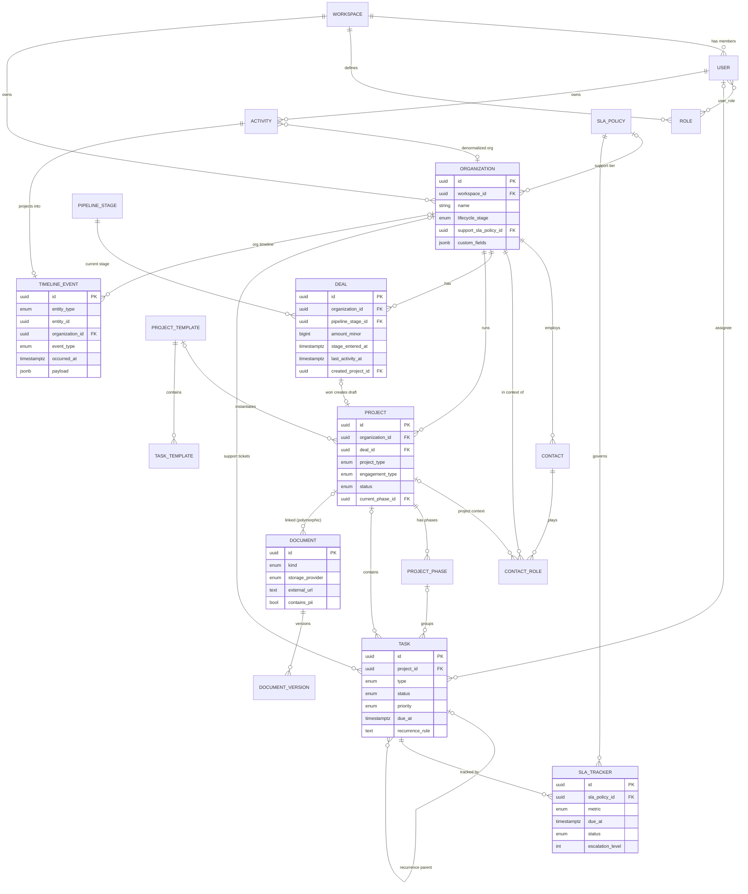

# 3. ER diagram

Tag/Tagging, CustomFieldDefinition, AuditLog, Reminder, NotificationPreference, Integration a ImportJob
jsou pro čitelnost vynechány — vážou se polymorfně přes `entity_type/entity_id`, resp. na Workspace/User.
Polymorfní vazby (TimelineEvent, Document) jsou v diagramu zjednodušeny na primárního hostitele.

Živá kopie tohoto diagramu je i v [../architecture/data-model.md](../architecture/data-model.md) (ADR).
