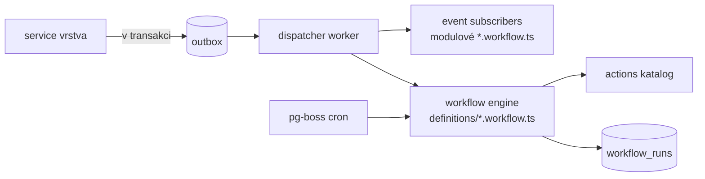

# Workflow engine

## Přístup: outbox + pg-boss (žádný Temporal/Kafka)

Objem událostí interního CRM jsou desítky/den. Postgres **outbox** + **pg-boss** (fronty a cron nad stejnou DB)
dává at-least-once doručení, retry s backoffem, cron i plnou dohledatelnost jedním SQL dotazem — bez nové
infrastruktury a bez provozní zátěže, kterou by 2členný tým neunesl. Přechod na těžší engine je zbytečný,
dokud nejsou statisíce eventů denně.

## Tok



1. **Zápis eventu:** service publikuje `DomainEvent` → zapíše řádek do `outbox` ve **stejné transakci**
   jako změnu dat (transactional outbox → žádná ztráta ani fantom event).
2. **Dispatch:** worker čte outbox, doručuje subscriberům (modulové `*.workflow.ts`) a workflow enginu.
3. **Engine:** vyhodnotí `conditions`, spustí `actions`; každý běh = řádek ve `workflow_runs`
   (`idempotency_key = event_id + workflow_key`, status, retry count, chyba).
4. **Cron triggery:** pg-boss plánuje časové workflowy (overdue, SLA, recurring, stale-deal, account review).

## Idempotence & retry
- `workflow_runs.idempotency_key` unique → stejný event nespustí workflow dvakrát.
- Akce jsou idempotentní (viz [../data-model/conventions.md](../data-model/conventions.md)).
- Selhání akce → retry s exponenciálním backoffem (pg-boss), po vyčerpání → `failed` + alert v Settings → Workflows.

## DSL (deklarativní definice)
```ts
defineWorkflow({
  key: "deal-won-create-project",
  trigger: { type: "event", event: "deal.won" },      // nebo { type: "schedule", cron: "0 7 * * *" }
  conditions: [{ field: "deal.createdProjectId", op: "isNull" }],
  actions: [
    { type: "create-project-from-template", params: { templateFrom: "deal.projectTypeHint", status: "draft" } },
    { type: "notify", params: { category: "task_assigned", to: "project.owner" } },
  ],
});
```
Definice jsou **data** → lze je vypsat, logovat, per-workspace zapnout/vypnout a později editovat v UI
nebo exportovat do n8n. Katalog akcí: `create-project-from-template`, `provision-tasks`, `create-task`,
`notify`, `escalate`, `create-reminder`, `write-timeline`, `call-webhook`, `send-email`.
