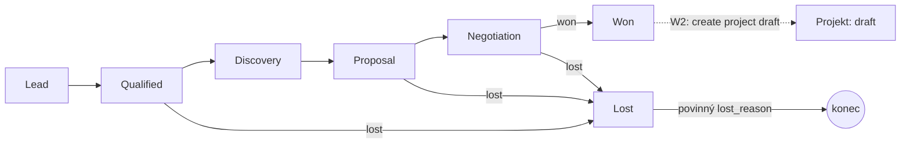
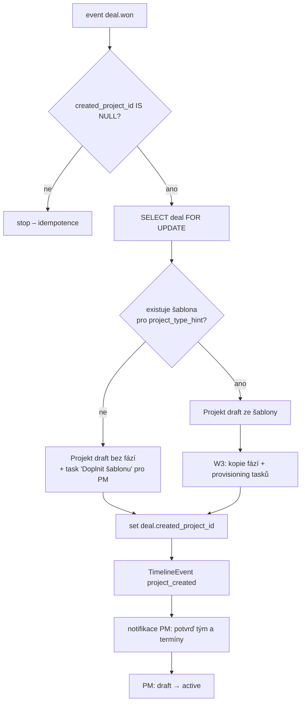
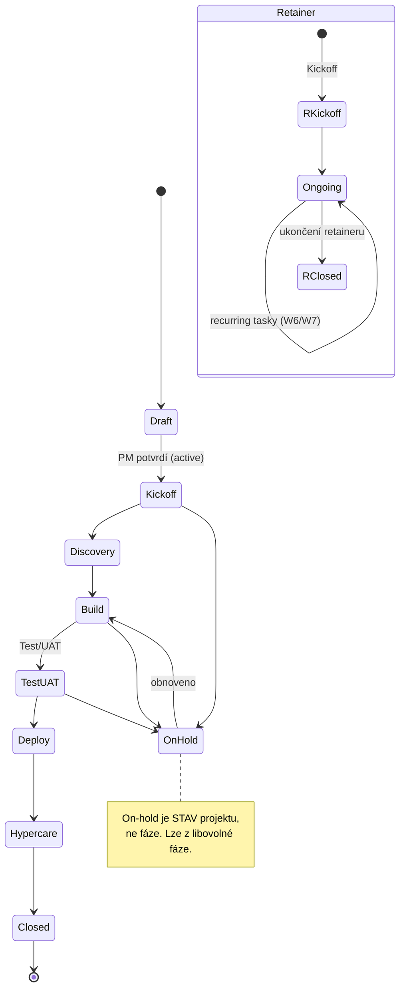
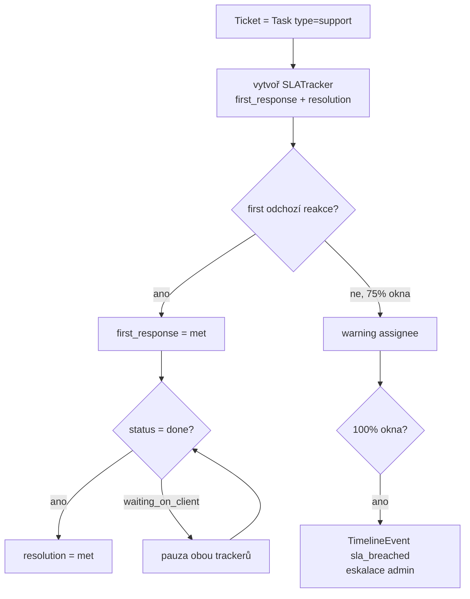
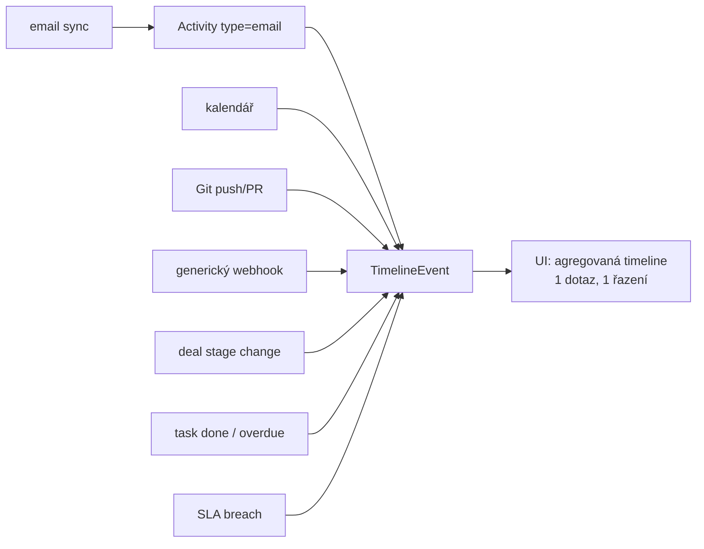

# 5. Lifecycle diagramy (Mermaid)

## Sales pipeline

```mermaid
flowchart LR
    Lead --> Qualified --> Discovery --> Proposal --> Negotiation
    Negotiation -->|won| Won
    Negotiation -->|lost| Lost
    Proposal -->|lost| Lost
    Qualified -->|lost| Lost
    Won -.->|W2: create project draft| ProjDraft[Projekt: draft]
    Lost -->|povinný lost_reason| End((konec))
```

## Won deal → projekt (W2 + W3)

```mermaid
flowchart TD
    A[event deal.won] --> B{created_project_id IS NULL?}
    B -- ne --> Z[stop – idempotence]
    B -- ano --> C[SELECT deal FOR UPDATE]
    C --> D{existuje šablona<br/>pro project_type_hint?}
    D -- ne --> E[Projekt draft bez fází<br/>+ task 'Doplnit šablonu' pro PM]
    D -- ano --> F[Projekt draft ze šablony]
    F --> G[W3: kopie fází + provisioning tasků]
    E --> H[set deal.created_project_id]
    G --> H
    H --> I[TimelineEvent project_created]
    I --> J[notifikace PM: potvrď tým a termíny]
    J --> K[PM: draft → active]
```

## Delivery lifecycle projektu

```mermaid
stateDiagram-v2
    [*] --> Draft
    Draft --> Kickoff: PM potvrdí (active)
    Kickoff --> Discovery
    Discovery --> Build
    Build --> TestUAT: Test/UAT
    TestUAT --> Deploy
    Deploy --> Hypercare
    Hypercare --> Closed
    Closed --> [*]

    Kickoff --> OnHold
    Build --> OnHold
    TestUAT --> OnHold
    OnHold --> Build: obnoveno

    note right of OnHold
        On-hold je STAV projektu,
        ne fáze. Lze z libovolné fáze.
    end note

    state Retainer {
        [*] --> RKickoff: Kickoff
        RKickoff --> Ongoing
        Ongoing --> Ongoing: recurring tasky (W6/W7)
        Ongoing --> RClosed: ukončení retaineru
    }
```

## Support ticket + SLA (W5)

```mermaid
flowchart TD
    A[Ticket = Task type=support] --> B[vytvoř SLATracker<br/>first_response + resolution]
    B --> C{first odchozí reakce?}
    C -- ano --> D[first_response = met]
    C -- ne, 75% okna --> W[warning assignee]
    W --> X{100% okna?}
    X -- ano --> BR[TimelineEvent sla_breached<br/>eskalace admin]
    D --> R{status = done?}
    R -- ano --> RS[resolution = met]
    R -- waiting_on_client --> P[pauza obou trackerů]
    P --> R
```

## Události → timeline (W9)

```mermaid
flowchart LR
    E1[email sync] --> A[Activity type=email]
    A --> T[TimelineEvent]
    E2[kalendář] --> T
    E3[Git push/PR] --> T
    E4[generický webhook] --> T
    E5[deal stage change] --> T
    E6[task done / overdue] --> T
    E7[SLA breach] --> T
    T --> UI[UI: agregovaná timeline<br/>1 dotaz, 1 řazení]
```
